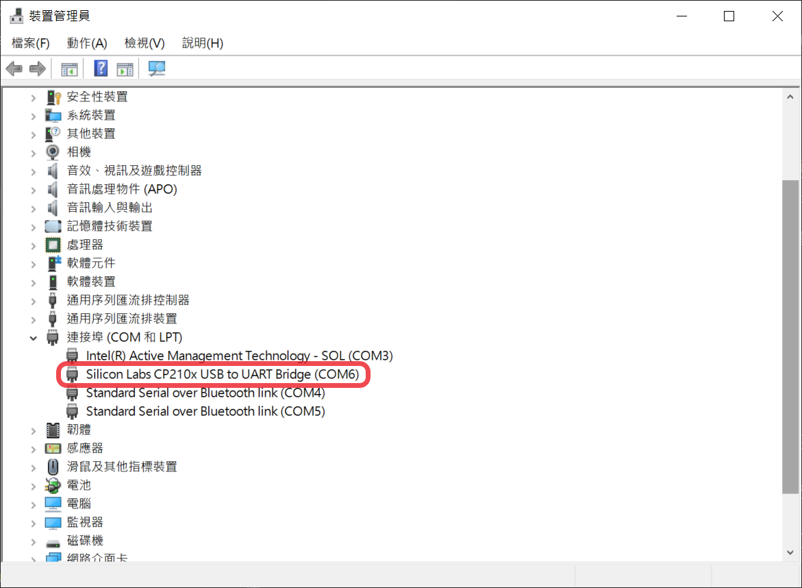
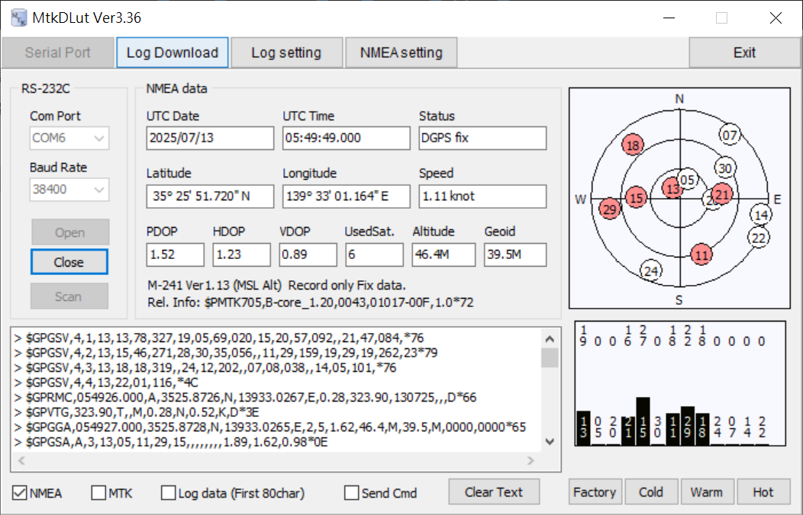
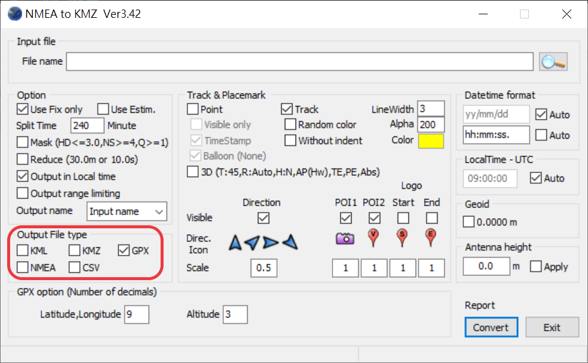
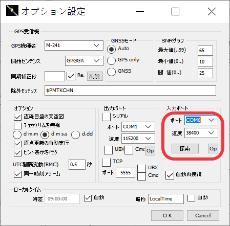
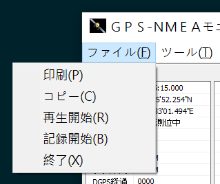
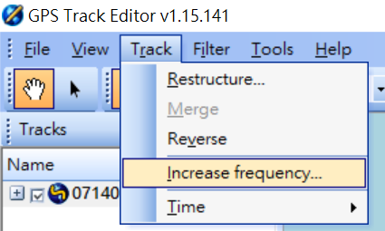

<div align="center"><p><a href="./README.en.md"></a> <a href="./README.md"></a> <a href="./README.ja.md"></a> </p></div>
<!--多國語言tab寫法-->
<!--https://github.com/OpenAiTx/OpenAiTx/blob/main/README.md-->

# Holux M-241 User Guide (Windows 11 & Apple Silicon)

## Preface

The Holux M-241 has been discontinued, and the original company has also been dissolved. Information can only be obtained online.
This page describes how to use the Holux M-241 on Windows 11 and Apple Silicon (e.g., MacBook Air M3), including:

- Driver installation
- Track log export from the device
- Real-time GPS information reading on Windows

---

## Holux M-241 Device Introduction

The Holux M-241 uses the MediaTek MTK3318 chip and the NMEA0183 v3.1 communication protocol.
For power, it uses a single AA battery, with a battery life of about 10–12 hours.
The device can connect to a computer via mini USB or Bluetooth.
For details, see: [https://holux.info/m-241/](https://holux.info/m-241/) (Unofficial Website)

---

## Windows 11 / Windows 10

### Driver Installation

Since official drivers are unavailable, you can use the [CP210x Drivers](https://www.silabs.com/documents/public/software/CP210x_Windows_Drivers.zip) provided by [Silicon Labs](https://www.silabs.com/developer-tools/usb-to-uart-bridge-vcp-drivers?tab=downloads).

📦 Backup Download: [CP210x_Windows_Drivers.zip](./CP210x_Windows_Drivers.zip)

Installation steps:

1. Unzip the file
2. Right-click on `slabvcp.inf` → select "Install"
3. After plugging in the M-241 device, you should see `Silicon Labs CP210x` and its corresponding COM Port under **Device Manager > Ports (COM & LPT)**

📷 As shown (COM6):


---

### GPS Software Tools

Source: [http://4river.a.la9.jp/gps/indexj.htm](http://4river.a.la9.jp/gps/indexj.htm)

#### MtkDLut

- Functions: Read GPS status, download/delete tracks, reset GPS settings (hot/warm/cold)
- 📦 [MtkDLut](http://4river.a.la9.jp/gps/file/MtkDLutj.htm) / Backup Download: [MtkDLut336.zip](./MtkDLut336.zip)
- Usage:
  - Set Baud Rate to **38400**, click **Scan**
    
  - Successfully connected device screen (displays current device GPS status, resets device GPS settings):
    
  - **Log Download** page operations (download tracks, delete tracks):
    
  - **Log Setting** page settings:
    

#### NMEA2KMZ

- Functions: Track format conversion (KML/KMZ/GPX/NMEA/CSV)
- 📦 [NMEA2KMZ](http://4river.a.la9.jp/gps/file/nmea2kmzj.htm) / Backup Download: [NMEA2KMZ342.zip](./NMEA2KMZ342.zip)
- Usage:
  - Select the track file, check the format under **Output File type**, click **Convert**
    

#### NMEA

- Functions: Read GPS status, real-time record/replay tracks
- 📦 [NMEA](http://4river.a.la9.jp/gps/file/NmeaMonj.htm) / Backup Download: [NMEA407.zip](./NMEA407.zip)
- Usage:
  - Set the correct COM PORT, set Baud Rate to **38400**, click **OK**
    
  - Successfully connected and positioned screen:
    
  - Record/stop/replay operations can be performed via the "ファイル" (File) menu:
    

---

## macOS 15 (MacBook Air M2/M3)

### Driver Installation (macOS)

Similarly, you can use Silicon Labs drivers: [Mac_OSX_VCP_Driver.zip](https://www.silabs.com/documents/public/software/Mac_OSX_VCP_Driver.zip)

📦 Backup Download: [macOS_VCP_Driver.zip](./macOS_VCP_Driver.zip)

Installation steps:

1. Unzip and mount `SiLabsUSBDriverDisk.dmg`
2. Install and authorize security permissions (requires administrator password)
3. After plugging in the device, you should see `/dev/tty.SLAB_USBtoUART`

📷 As shown:


---

### Software Tool (houdahGPS)

Official Website: [https://www.houdah.com/houdahGPS/](https://www.houdah.com/houdahGPS/)

Free GUI tool, based on GPSBabel. Choose according to your macOS version:

- macOS 10.10 or newer: [HoudahGPS 8.1.3](https://www.houdah.com/houdahGPS/download_assets/HoudahGPS8.1.3.zip)
  📦 Backup Download: [HoudahGPS8.1.3.zip](./HoudahGPS8.1.3.zip)

- macOS 10.10 or older: [HoudahGPS 6.0](https://www.houdah.com/houdahGPS/download_assets/HoudahGPS6.0.zip)
  📦 Backup Download: [HoudahGPS6.0.zip](./HoudahGPS6.0.zip)

---

### Exporting Tracks with houdahGPS

Open houdahGPS and make the following settings:

- **Preset**: Holux
- **Port**: USB
- **Names**: SLAB_USBtoUART (according to the device's displayed name)
- **Option**: Can be left blank (checking this will automatically delete device tracks)
- **Data**: Track Logs & Waypoints
- **Output**: GPX / KML / NMEA (choose any)

📷 Operation Interface:


Press **Import** to download track data.

---

## GPX File Resampling Tool Guide

This part provides two solutions for resampling GPX track files, suitable for different platforms.

---

### ✅ Method 1: Using GPS Track Editor (Windows Only)

📥 Official Website: [GPS Track Editor](http://www.gpstrackeditor.com/)  
📦 Download Program: [GPS Track Editor 1.15](http://www.gpstrackeditor.com/transfer/GpsTrackEditor-1.15.141.exe)  
📁 Alternative Download: [GpsTrackEditor-1.15.141.exe](./GpsTrackEditor-1.15.141.exe)

#### Usage Steps:

1. Download and run the installer (`GpsTrackEditor-1.15.141.exe`)  
2. Launch the program after installation  
3. Open the target GPX file  
     
4. From the top menu, select `Track → Increase Frequency`  
     
5. Enter the desired resampling distance (e.g., 200 meters)  
     

---

### 🐍 Method 2: Using Python Script (Windows / macOS / Linux)

`resample_gpx.py` is a command-line tool based on Python that allows customizable resampling distances.

📦 Download Script: [resample_gpx.py](./resample_gpx.py)

#### Install Dependencies (Example for Ubuntu):

```bash
sudo apt update
sudo apt install python3-pip
pip install gpxpy geopy numpy
```

#### Usage:

```bash
python3 resample_gpx.py input_file.gpx output_file.gpx [distance]
```

- `input_file`: Required, path to the input GPX file  
- `output_file`: Required, path to the output GPX file  
- `distance`: Optional, target resampling distance (in meters), default is 200 meters

---

## References

- [OpenStreetMap Wiki - Holux M-241 (JA)](https://wiki.openstreetmap.org/wiki/JA:Holux_M-241)
- [Yamareco Track Usage Experience](https://www.yamareco.com/modules/yamanote/detail.php?nid=2428)
- [Ushirotaro Blog](https://ushirotaro.hatenablog.com/entry/2021/05/23/223821)
- [Yama2733's HOLUX Webpage](https://www.katch.ne.jp/~yama2733/Holuxm/HOLUXM.htm)