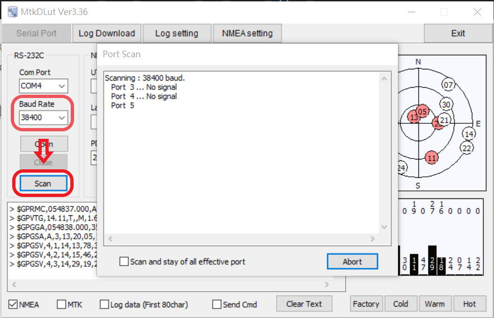
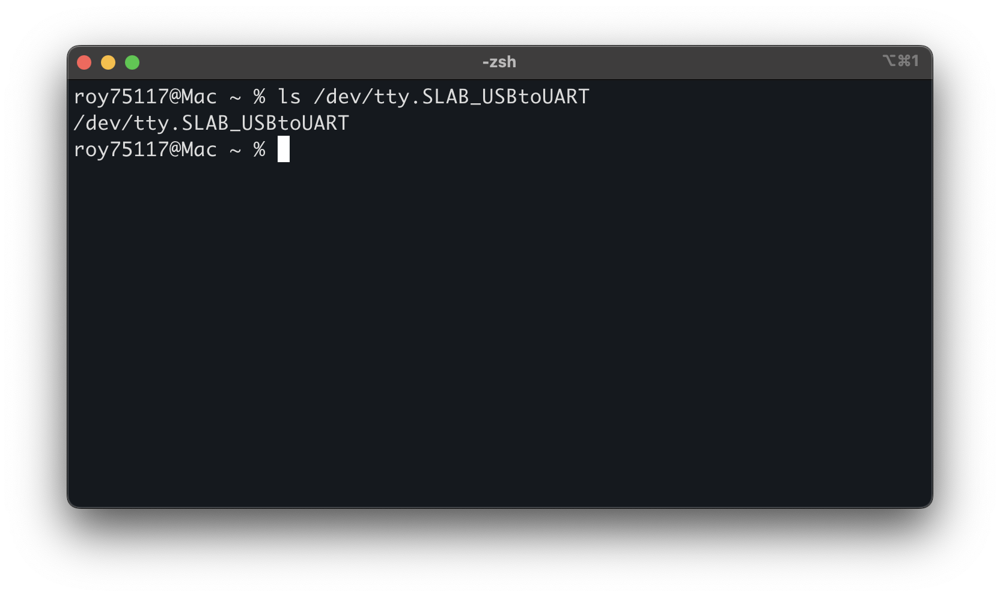

<div align="center"><p><a href="./README.en.md"></a> <a href="./README.md"></a> <a href="./README.ja.md"></a> </p></div>
<!--多國語言tab寫法-->
<!--https://github.com/OpenAiTx/OpenAiTx/blob/main/README.md-->

# Holux M-241 利用ガイド（Windows 11 & Apple Silicon）

## はじめに

Holux M-241 は既に生産中止となっており、元の会社も解散しているため、関連情報はオンラインでしか入手できません。
このページでは、Windows 11 および Apple Silicon（例：MacBook M3）で Holux M-241 を使用する方法について説明します。内容は以下の通りです。

- ドライバーのインストール
- デバイスからのトラックログのエクスポート
- WindowsでのリアルタイムGPS情報読み取り

---

## Holux M-241 デバイスの概要

Holux M-241 は MediaTek MTK3318 チップを採用し、NMEA0183 v3.1 通信プロトコルを使用しています。
電源は単三電池1本を使用し、約10～12時間のバッテリー駆動が可能です。
デバイスは mini USB または Bluetooth を介してコンピューターに接続できます。
詳細については、以下を参照してください：[https://holux.info/m-241/](https://holux.info/m-241/)（非公式サイト）

---

## Windows 11 / Windows 10

### ドライバーのインストール

公式ドライバーは入手できないため、[Silicon Labs](https://www.silabs.com/developer-tools/usb-to-uart-bridge-vcp-drivers?tab=downloads) が提供する [CP210x ドライバー](https://www.silabs.com/documents/public/software/CP210x_Windows_Drivers.zip) を使用できます。

📦 バックアップダウンロード：[CP210x_Windows_Drivers.zip](./CP210x_Windows_Drivers.zip)

インストール手順：

1. ファイルを解凍します。
2. `slabvcp.inf` を右クリック → 「インストール」を選択します。
3. M-241 デバイスを接続すると、**デバイスマネージャー > ポート (COM と LPT)** に `Silicon Labs CP210x` と対応する COM ポートが表示されます。

📷 例（COM6）：


---

### GPS ソフトウェアツール

出典：[http://4river.a.la9.jp/gps/indexj.htm](http://4river.a.la9.jp/gps/indexj.htm)

#### MtkDLut

- 機能：GPSステータスの読み取り、トラックのダウンロード/削除、GPS設定のリセット（ホット/ウォーム/コールド）
- 📦 [MtkDLut](http://4river.a.la9.jp/gps/file/MtkDLutj.htm) / バックアップダウンロード：[MtkDLut336.zip](./MtkDLut336.zip)
- 使用方法：
  - ボーレートを**38400**に設定し、**Scan**をクリックします。
    
  - デバイスに正常に接続された画面（現在のデバイスGPSステータスの表示、デバイスGPS設定のリセット）：
    
  - **Log Download** ページの操作（トラックのダウンロード、トラックの削除）：
    
  - **Log Setting** ページの設定：
    

#### NMEA2KMZ

- 機能：トラック形式の変換（KML/KMZ/GPX/NMEA/CSV）
- 📦 [NMEA2KMZ](http://4river.a.la9.jp/gps/file/nmea2kmzj.htm) / バックアップダウンロード：[NMEA2KMZ342.zip](./NMEA2KMZ342.zip)
- 使用方法：
  - トラックファイルを選択し、**Output File type** で形式をチェックし、**Convert** をクリックします。
    

#### NMEA

- 機能：GPSステータスの読み取り、リアルタイムのトラック記録/再生
- 📦 [NMEA](http://4river.a.la9.jp/gps/file/NmeaMonj.htm) / バックアップダウンロード：[NMEA407.zip](./NMEA407.zip)
- 使用方法：
  - 正しいCOM PORTを設定し、ボーレートを**38400**に設定し、**OK**をクリックします。
    
  - 正常に接続および測位された画面：
    
  - 「ファイル」メニューから記録/停止/再生操作を実行できます。
    

---

## macOS 15（MacBook Air M2/M3）

### ドライバーのインストール（macOS）

同様に、Silicon Labs のドライバーを使用できます：[Mac_OSX_VCP_Driver.zip](https://www.silabs.com/documents/public/software/Mac_OSX_VCP_Driver.zip)

📦 バックアップダウンロード：[macOS_VCP_Driver.zip](./macOS_VCP_Driver.zip)

インストール手順：

1. `SiLabsUSBDriverDisk.dmg` を解凍してマウントします。
2. セキュリティ権限をインストールして認証します（管理者パスワードが必要です）。
3. デバイスを接続すると、`/dev/tty.SLAB_USBtoUART` が表示されるはずです。

📷 例：


---

### ソフトウェアツール（houdahGPS）

公式サイト：[https://www.houdah.com/houdahGPS/](https://www.houdah.com/houdahGPS/)

無料のGUIツールで、GPSBabelに基づいています。macOSのバージョンに応じて選択してください。

- macOS 10.10 以降：[HoudahGPS 8.1.3](https://www.houdah.com/houdahGPS/download_assets/HoudahGPS8.1.3.zip)
  📦 バックアップダウンロード：[HoudahGPS8.1.3.zip](./HoudahGPS8.1.3.zip)

- macOS 10.10 以前：[HoudahGPS 6.0](https://www.houdah.com/houdahGPS/download_assets/HoudahGPS6.0.zip)
  📦 バックアップダウンロード：[HoudahGPS6.0.zip](./HoudahGPS6.0.zip)

---

### houdahGPS を使用したトラックのエクスポート

houdahGPS を開き、以下の設定を行います。

- **Preset**：Holux
- **Port**：USB
- **Names**：SLAB_USBtoUART（デバイスの表示名による）
- **Option**：空白のままで構いません（チェックを入れるとデバイスのトラックが自動的に削除されます）
- **Data**：Track Logs & Waypoints
- **Output**：GPX / KML / NMEA（いずれかを選択）

📷 操作インターフェース：


**Import** を押すと、トラックデータがダウンロードされます。

---

## GPXファイル再サンプリングツールガイド

このセクションでは、GPXトラックファイルを再サンプリングするための2つの方法を提供します。それぞれ異なるプラットフォームに対応しています。

---

### ✅ 方法1：GPS Track Editorを使用（Windows専用）

📥 公式ウェブサイト：[GPS Track Editor](http://www.gpstrackeditor.com/)  
📦 プログラムのダウンロード：[GPS Track Editor 1.15](http://www.gpstrackeditor.com/transfer/GpsTrackEditor-1.15.141.exe)  
📁 代替ダウンロードリンク：[GpsTrackEditor-1.15.141.exe](./GpsTrackEditor-1.15.141.exe)

#### 使用手順：

1. インストールファイル（`GpsTrackEditor-1.15.141.exe`）をダウンロードして実行  
2. インストール完了後、プログラムを起動  
3. 対象のGPXファイルを開く  
     
4. 上部メニューから `Track → Increase Frequency` を選択  
     
5. 希望する再サンプリング間隔（例：200メートル）を入力  
     

---

### 🐍 方法2：Pythonスクリプトを使用（Windows / macOS / Linux）

`resample_gpx.py` は、カスタマイズ可能なサンプリング間隔を備えたPythonベースのコマンドラインツールです。

📦 スクリプトのダウンロード：[resample_gpx.py](./resample_gpx.py)

#### 依存パッケージのインストール（Ubuntuを例に）：

```bash
sudo apt update
sudo apt install python3-pip
pip install gpxpy geopy numpy
```

#### 使用方法：

```bash
python3 resample_gpx.py input_file.gpx output_file.gpx [distance]
```

- `input_file`：必須、入力GPXファイルのパス  
- `output_file`：必須、出力GPXファイルのパス  
- `distance`：オプション、目標サンプリング間隔（単位：メートル）、デフォルトは200メートル

---

## 参考文献

- [OpenStreetMap Wiki - Holux M-241 (JA)](https://wiki.openstreetmap.org/wiki/JA:Holux_M-241)
- [ヤマレコ 軌跡活用記](https://www.yamareco.com/modules/yamanote/detail.php?nid=2428)
- [うしろたろうブログ](https://ushirotaro.hatenablog.com/entry/2021/05/23/223821)
- [山2733の HOLUX ウェブページ](https://www.katch.ne.jp/~yama2733/Holuxm/HOLUXM.htm)