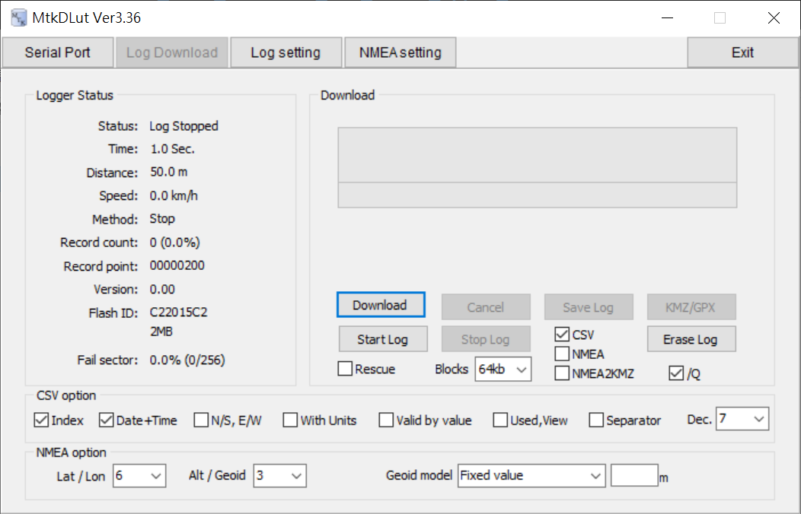
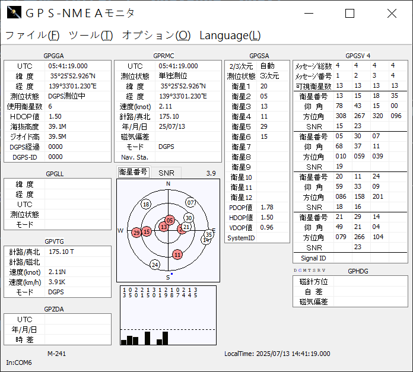
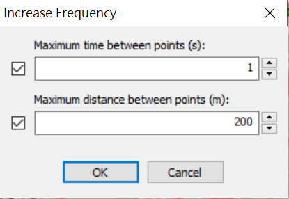

<div align="center"><p><a href="./README.en.md"></a> <a href="./README.md"></a> <a href="./README.ja.md"></a> </p></div>
<!--多國語言tab寫法-->
<!--https://github.com/OpenAiTx/OpenAiTx/blob/main/README.md-->

# Holux M-241 使用指南（Windows 11 & Apple Silicon）

## 前言

Holux M-241 已經停產，原公司亦已解散，僅能從網路上取得相關資訊。  
本頁介紹如何在 Windows 11 及 Apple Silicon（如 MacBook M3）上使用 Holux M-241，包含：

- 安裝驅動程式
- 輸出裝置中的軌跡紀錄
- 在 Windows 上即時讀取 GPS 資訊

---

## Holux M-241 裝置簡介

Holux M-241 採用聯發科 MTK3318 晶片，使用 NMEA0183 v3.1 通訊協定。  
供電方面，可使用單顆 3 號乾電池，續航約 10–12 小時。  
裝置可透過 mini USB 或藍牙連接電腦。  
詳見：[https://holux.info/m-241/](https://holux.info/m-241/)（非官方網站）

---

## Windows 11 / Windows 10

### 驅動程式安裝

由於官方驅動無法取得，可改用 [Silicon Labs](https://www.silabs.com/developer-tools/usb-to-uart-bridge-vcp-drivers?tab=downloads) 提供的 [CP210x 驅動程式](https://www.silabs.com/documents/public/software/CP210x_Windows_Drivers.zip)。

📦 備份載點：[CP210x_Windows_Drivers.zip](./CP210x_Windows_Drivers.zip)

安裝方式：

1. 解壓縮檔案  
2. 對 `slabvcp.inf` 右鍵 → 選擇「安裝」  
3. 插入 M-241 裝置後，應會在 **裝置管理員 > 連接埠（COM 和 LPT）** 看到 `Silicon Labs CP210x` 以及對應的 COM Port

📷 如圖（COM6）：  


---

### GPS 軟體工具

來源：[http://4river.a.la9.jp/gps/indexj.htm](http://4river.a.la9.jp/gps/indexj.htm)

#### MtkDLut

- 功能：讀取 GPS 狀態、下載/刪除軌跡、重置 GPS 設定（hot/warm/cold）  
- 📦 [MtkDLut](http://4river.a.la9.jp/gps/file/MtkDLutj.htm) / 備份載點：[MtkDLut336.zip](./MtkDLut336.zip)
- 使用方式：
  - 設定 Baud Rate 為 **38400**，點擊 **Scan**
    
  - 成功連接裝置畫面(顯示目前裝置GPS狀態、重置裝置GPS設定)：
    
  - **Log Download** 頁面操作(下載軌跡、刪除軌跡)：
    
  - **Log Setting** 頁面設定：
    

#### NMEA2KMZ

- 功能：軌跡格式轉換（KML/KMZ/GPX/NMEA/CSV）  
- 📦 [NMEA2KMZ](http://4river.a.la9.jp/gps/file/nmea2kmzj.htm) / 備份載點：[NMEA2KMZ342.zip](./NMEA2KMZ342.zip)
- 使用方式：
  - 選擇軌跡檔案，於 **Output File type** 勾選格式，點選 **Convert**
    

#### NMEA

- 功能：讀取 GPS 狀態、即時紀錄/重播軌跡  
- 📦 [NMEA](http://4river.a.la9.jp/gps/file/NmeaMonj.htm) / 備份載點：[NMEA407.zip](./NMEA407.zip)
- 使用方式：
  - 設定正確的 COM PORT，Baud Rate 設為 **38400**，點選 **OK**
    
  - 成功連接及定位畫面：
    
  - 透過「ファイル」選單可進行記錄／停止／重播操作：
    

---

## macOS 15（MacBook Air M2/M3）

### 驅動程式安裝（macOS）

同樣可使用 Silicon Labs 的驅動程式：[Mac_OSX_VCP_Driver.zip](https://www.silabs.com/documents/public/software/Mac_OSX_VCP_Driver.zip)

📦 備份載點：[macOS_VCP_Driver.zip](./macOS_VCP_Driver.zip)

安裝方式：

1. 解壓縮並掛載 `SiLabsUSBDriverDisk.dmg`  
2. 安裝並授權安全性權限（需輸入管理者密碼）  
3. 插入裝置後，應可見 `/dev/tty.SLAB_USBtoUART`

📷 如圖：  


---

### 軟體工具（houdahGPS）

官網：[https://www.houdah.com/houdahGPS/](https://www.houdah.com/houdahGPS/)

免費 GUI 工具，基於 GPSBabel。依 macOS 版本選擇：

- macOS 10.10 或更新：[HoudahGPS 8.1.3](https://www.houdah.com/houdahGPS/download_assets/HoudahGPS8.1.3.zip)  
  📦 備份載點：[HoudahGPS8.1.3.zip](./HoudahGPS8.1.3.zip)

- macOS 10.10 以下：[HoudahGPS 6.0](https://www.houdah.com/houdahGPS/download_assets/HoudahGPS6.0.zip)  
  📦 備份載點：[HoudahGPS6.0.zip](./HoudahGPS6.0.zip)

---

### 使用 houdahGPS 匯出軌跡

開啟 houdahGPS，進行以下設定：

- **Preset**：Holux  
- **Port**：USB  
- **Names**：SLAB_USBtoUART（依裝置顯示名稱）  
- **Option**：可留空（勾選則會自動刪除裝置軌跡）
- **Data**：Track Logs & Waypoints
- **Output**：GPX / KML / NMEA（任選）

📷 操作介面：  


按下 **Import** 即可下載軌跡資料。

---

## GPX 檔案重新採點工具指南

本章節提供兩種重新採樣（Resampling）GPX 軌跡檔的解決方案，分別適用於不同平台。

---

### ✅ 方法一：使用 GPS Track Editor（僅限 Windows）

📥 官方網站：[GPS Track Editor](http://www.gpstrackeditor.com/)  
📦 下載程式：[GPS Track Editor 1.15](http://www.gpstrackeditor.com/transfer/GpsTrackEditor-1.15.141.exe)  
📁 備用載點：[GpsTrackEditor-1.15.141.exe](./GpsTrackEditor-1.15.141.exe)

#### 使用步驟：

1. 下載並執行安裝檔（`GpsTrackEditor-1.15.141.exe`）  
2. 安裝完成後啟動程式  
3. 開啟目標 GPX 檔案  
     
4. 從上方選單選取 `Track → Increase Frequency`  
     
5. 輸入欲重新採樣的間距（例如：200 公尺）  
     

---

### 🐍 方法二：使用 Python 腳本（Windows / macOS / Linux）

`resample_gpx.py` 是一個基於 Python 的指令列工具，可自訂採樣間距。

📦 下載腳本：[resample_gpx.py](./resample_gpx.py)

#### 安裝依賴套件（以 Ubuntu 為例）：

```bash
sudo apt update
sudo apt install python3-pip
pip install gpxpy geopy numpy
```

#### 使用方式：

```bash
python3 resample_gpx.py input_file.gpx output_file.gpx [distance]
```

- `input_file`：必填，輸入 GPX 檔案路徑  
- `output_file`：必填，輸出 GPX 檔案路徑  
- `distance`：選填，目標採樣間距（單位：公尺），預設為 200 公尺

---

## 參考資料

- [OpenStreetMap Wiki - Holux M-241 (JA)](https://wiki.openstreetmap.org/wiki/JA:Holux_M-241)
- [Yamareco 軌跡使用經驗](https://www.yamareco.com/modules/yamanote/detail.php?nid=2428)
- [Ushirotaro 部落格](https://ushirotaro.hatenablog.com/entry/2021/05/23/223821)
- [山2733的 HOLUX 網頁](https://www.katch.ne.jp/~yama2733/Holuxm/HOLUXM.htm)
