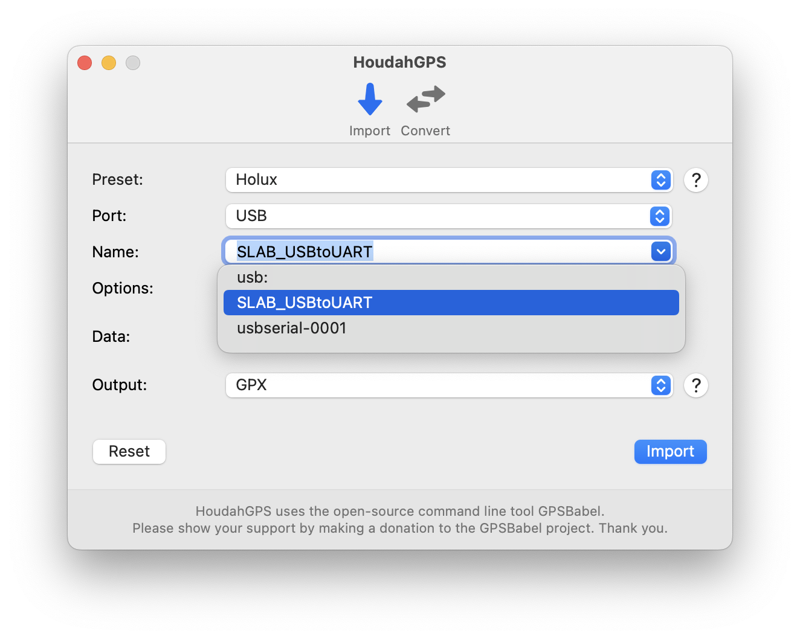

# Holux_M-241_Guidance_for_Win11_and_Apple_Silicon
## 前言
目前Holux M-241已經停產，公司已經解散。唯一只能從網路上找到相關資訊
此網頁將介紹在Windows 11和Apple Silicon(Macbook M3)上使用Holux M-241
包含正確驅動Holux M-241、從M-241裝置上輸出紀錄的軌跡以及直接在Win11上直接讀取GPS資訊

### Holux M-241
Holux M241使用的是聯發科MTK3318晶片，通訊協定標準是NMEA0183 v3.1
可用單顆三號電池驅動，單顆乾性三號電池續航力約10~12小時。
可透過mini USB或藍芽跟電腦連結。
詳細規格可參考 https://holux.info/m-241/ (非官方網站)

### Windows 11/Windows 10
#### 安裝驅動(Win)
因為公司已經倒閉，官網已經關閉，所以網路上找不到官方出的支援Windows的驅動。
而可以借用[Silocon Labs](https://www.silabs.com/developer-tools/usb-to-uart-bridge-vcp-drivers?tab=downloads)的[CP210x驅動](https://www.silabs.com/documents/public/software/CP210x_Windows_Drivers.zip)來驅動Holux M241。 
備份下載點：[CP210x_Windows_Drivers.zip](./CP210x_Windows_Drivers.zip)

接壓縮壓縮檔之後，直接在**slabvcp.inf**按滑鼠右鍵，選擇**安裝(I)**
之後接上M241後，應該可以在**裝置管理員**的**連接阜(COM和LPT)**看到**Silicon Labs CP210x**以及他對應的COM PORT。

如圖，Windows平台順利驅動到Holus M-241並且連接的COM PORT是COM6

#### 安裝套件 (MtkDLut, NMEA2KMZ, NMEA)
http://4river.a.la9.jp/gps/indexj.htm 
這個網站提供各種相容於Holux M2-41的Windows平台套件
所有皆無須安裝，解壓即可立即使用。

- MtkDLut : http://4river.a.la9.jp/gps/file/MtkDLutj.htm
可讀取GPS狀態，下載裝置軌跡，刪除裝置軌跡，重置GPS設定(hot, warm, cold)
- NMEA2KMZ : http://4river.a.la9.jp/gps/file/nmea2kmzj.htm
轉換軌跡格式(KML, KMZ, GPX, NMEA, CSV)
- NMEA : http://4river.a.la9.jp/gps/file/NmeaMonj.htm 
可讀取GPS狀態，直接在Windows紀錄軌跡，重播紀錄的軌跡

#### MtkDLut
http://4river.a.la9.jp/gps/indexj.htm#006
備份下載點：[MtkDLut336.zip](./MtkDLut336.zip)

#### NMEA2KMZ
http://4river.a.la9.jp/gps/indexj.htm#003
備份下載點：[NMEA2KMZ342.zip](./NMEA2KMZ342.zip)

#### NMEA
http://4river.a.la9.jp/gps/indexj.htm#001
備份下載點：[NMEA407.zip](./NMEA407.zip)

### MacOS 15(Macbook Air M2/M3)
#### 安裝驅動(MacOS)
MacOS也可以借用[Silocon Labs](https://www.silabs.com/developer-tools/usb-to-uart-bridge-vcp-drivers?tab=downloads)的[CP210x驅動](https://www.silabs.com/documents/public/software/Mac_OSX_VCP_Driver.zip)來驅動Holux M-241。 
備份下載點：[macOS_VCP_Driver.zip](./macOS_VCP_Driver.zip)

解壓縮後，掛載**SiLabsUSBDriverDisk.dmg**，並且直接安裝。
過程會需要輸入管理者密碼和允許一些電腦權限
之後接上M-241後，應該可以在 **/dev/**下面看到**tty.SLAB_USBtoUART**。

#### 安裝套件 (houdahGPS)
https://www.houdah.com/houdahGPS/
houdahGPS是一個支援Holux M-241基於GPSBabel的免費GUI套件。
OSX 10.10或是之後的MacOS版本下載[HoudahGPS 8.1.3](https://www.houdah.com/houdahGPS/download_assets/HoudahGPS8.1.3.zip)
OSX 10.10之前的MacOS版本下載[HoudahGPS 6.0](https://www.houdah.com/houdahGPS/download_assets/HoudahGPS6.0.zip)

備份下載點：
- [HoudahGPS 8.1.3](./HoudahGPS8.1.3.zip)
- [HoudahGPS 6.0](./HoudahGPS6.0.zip)

#### houdahGPS
##### 輸出軌跡
打開houdahGPS後，會先詢問裝置和連接方式。
 - Preset : Holux
 - Port : USB
 - Names : SLAB_USBtoUART (依照/dev/下出現的裝置名稱，有所區別)
 - Option : 保持空白 (如勾選會輸出軌跡後直接刪除裝置上的軌跡)
 - Output : GPX/KML/KMZ (選擇你所想要輸出的軌跡檔案格式)

然後點選Import

##### 轉換軌跡格式

reference : 
https://wiki.openstreetmap.org/wiki/JA:Holux_M-241

https://www.yamareco.com/modules/yamanote/detail.php?nid=2428
	
https://ushirotaro.hatenablog.com/entry/2021/05/23/223821

https://www.katch.ne.jp/~yama2733/Holuxm/HOLUXM.htm	
